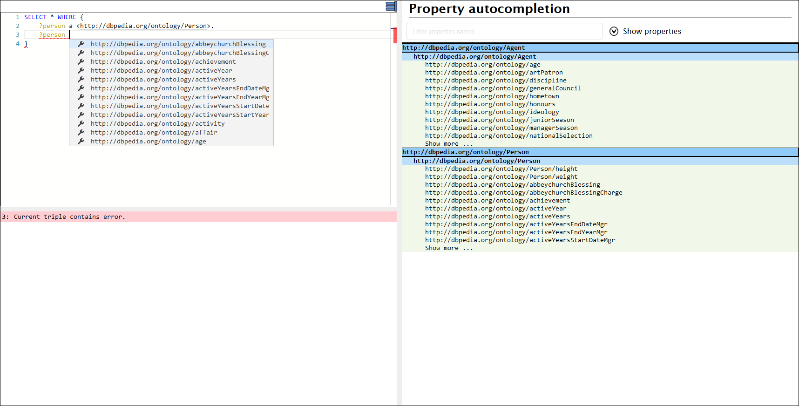

# Popis funkcionalit SPARQL editoru
Na následujícím obrázku je obrazovka SPARQL editoru. Editor obsahuje tři GUI komponenty:
* Textový editor sloužící ke psaní SPARQL dotazů.
* Chybová konzole vypisující syntaktické chyby .
* Postranní panel zobrazující hiearchicky uspořádané vlastnosti v případě jejich napovídání. 



## Základní funkcionality
Součástí editoru je **kontrola syntaktických chyb**. Tato kontrola je pokročilá a umí se zotavit i z více chyb naráz a všechny vypíše do chybové konzole. Editor také **zvýraznuje syntaxi** SPARQL dotazu. Vybrané součásti dotazu jako klíčová slova, proměnné, komentáře, atd. jsou barevně zvýrazněny.

## Atomatické doplňování 
Editor podporuje automatické doplňování:

* Klíčových slov SPARQL
* Názvů proměnných
* Názvů ontologických tříd při zadání rdf:type 
* Vlastností na základě známé třídy proměnné v subjektu


### Automatické doplňování názvu tříd

Následující příklad ukazuje SPARQL dotaz, který vyvolá automatickou nápovědu názvů tříd nacházející se v ontologii. Na místě `|Kurzor|` se nachází textový kurzor editoru a v jeho místě se zobrazí roletové menu s názvy tříd. V případě zmizení nápovědy lze nápovědu opět vyvolat pomocí CTRL + SPACE. 

```sparql
SELECT * WHERE {
  ?exampleVariable a |KURZOR|
}
```

### Automatické doplňování vlastností
Při známé třídě proměnné v subjektu editor nabídne nápovědu vlastností dané třídy a jejích nadtříd, viz příklad pod textem. Nápověda se zobrazí v roletového menu pod kurzorem a v postranním panelu, který má vlastnosti setříděné na základě hiearchie tříd. V případě zmizení nápovědy lze nápovědu opět vyvolat pomocí CTRL + SPACE. 

```
SELECT * WHERE {
    ?person a <http://dbpedia.org/ontology/Person>.
    ?person |KURZOR|
}
```

Nápovídání vlastností lze dobře řetězit jak je znázorněno na následujícím příkladu:
```
SELECT * WHERE {
    ?person a <http://dbpedia.org/ontology/Person>.
    ?person <http://dbpedia.org/ontology/deathPlace> ?deathPlace.
    ?deathPlace |KURZOR|
}
```

## Napovídání možných tříd objektu
Editor v případě známé vlastnosti zobrazuje při psaní objektu možné třídy, které dle ontologie mohou v objektu být. Následující příklad zobrazuje SPARQL dotaz, u kterého je zobrazena nápověda při psaní objektu. V případě zmizení nápovědy lze nápovědu opět vyvolat pomocí CTRL + SHIFT + SPACE.

```
SELECT * WHERE {
    ?person a <http://dbpedia.org/ontology/Person>.
    ?person <http://dbpedia.org/ontology/deathPlace> |KURZOR|
}
```

## Zobrazení možných tříd proměnné
SPARQL editor provádí pro každou proměnnou inferenci tříd, kterých může proměnná nabývat. Seznam všech tříd, kterými může proměnná být, lze získat při najetí na proměnnou pomocí kurzoru myši.

## Zobrazení popisků z ontologii
SPARQL editor umí zobrazovat popisky ontologii, konkrétně se jedná o popisky pomocí vlastnosti `rdfs:Label`. Popisky popsaných třídy a vlastnosti se zobrazí po najetí kurzorem myši na jejich IRI.